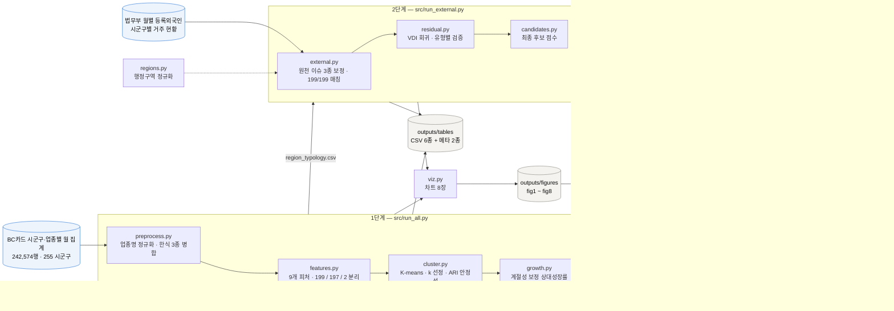

# 외국인 소비 히트맵 & 잠재 관광 상권 발굴

**한국어** · [English](README.md)

제1회 AI금융빅데이터플랫폼 소비데이터 활용 분석·아이디어 공모전 분석 코드.

BC카드 시군구·업종별 월 집계(2026.1~6)에서 `GENDER_CD=3`(외국인) 축을 분리해,
**외국인 소비를 유형화하고 잠재 관광 상권을 발굴**하는 파이프라인이다.

> **데이터는 저장소에 포함하지 않는다.** 공모전 데이터는 목적 외 사용·재배포·공개가
> 금지되어 있어 `data/`와 `outputs/`는 `.gitignore` 처리되어 있다. 코드만 공유하고,
> 원본 CSV는 각자 로컬 `data/ABP_CONTEST_DATA.csv`에 둔다.

## 실행

```bash
pip install -r requirements.txt
# data/ABP_CONTEST_DATA.csv 배치 후
python src/run_all.py

# 외부 데이터 결합 (data/external/moj_registered_foreigners.csv 배치 후)
python src/run_external.py

# 제출용 요약서 PDF (차트가 생성된 뒤에 실행)
pip install playwright && playwright install chromium
python report/render.py
```

`outputs/figures`에 차트 8장, `outputs/tables`에 CSV 6종과 실행 메타데이터
(`run_meta.json`·`external_meta.json`, 재현용 지표 스냅샷), `outputs/report`에 제출용
PDF가 생성된다. 한글 폰트는 나눔/노토 계열을 자동 탐색한다
(Ubuntu: `apt-get install -y fonts-nanum`).

## 시스템 구조



3단계이며 각각 따로 실행할 수 있다. 2단계는 1단계의 산출 테이블
(`region_typology.csv`)을 읽으므로 순서를 지켜야 하고, 3단계는 차트만 있으면 된다.
`viz.py`와 `candidates.py`는 단계 공용이다. `candidates.py`는 내부 전용 점수와 외부
결합 점수를 모두 제공해 두 결과를 비교할 수 있게 했다.

## 기술 스택

| 구분 | 사용 기술 | 위치 |
|---|---|---|
| 언어 | Python 3.11 | — |
| 데이터 처리 | pandas ≥ 2.0 (집계·피벗·결합), numpy ≥ 1.24 | `src/preprocess.py`, `src/features.py` |
| 군집 | scikit-learn ≥ 1.3 — `KMeans`, `StandardScaler`, `silhouette_score`, `adjusted_rand_score` | `src/cluster.py` |
| 차원 축소 | scikit-learn `PCA` (2차원 프로파일 지도) | `src/viz.py` |
| 회귀 | `numpy.linalg.lstsq` 기반 OLS(VDI 모형), `numpy.polyfit`(유형별 추세선) | `src/residual.py`, `src/viz.py` |
| 시각화 | matplotlib ≥ 3.7, `LinearSegmentedColormap` · `TwoSlopeNorm` 커스텀 컬러맵 | `src/viz.py` |
| 문서 | HTML + CSS 인쇄 규칙(`@page`, A4, 표 머리행 반복)을 Playwright + Chromium으로 렌더링 | `report/` |
| 폰트 | 나눔고딕 (차트와 PDF 공통) | `src/config.py`, `report/style.css` |
| 노트북 | Jupyter | `notebooks/analysis.ipynb` |
| 인코딩 | 법무부 원천은 CP949, 산출 CSV는 UTF-8-SIG (엑셀에서 바로 열림) | `src/external.py`, `src/run_all.py` |

`pandas`·`numpy`·`scikit-learn`·`matplotlib`은 `requirements.txt`에 고정되어 있다.
Playwright는 PDF 생성에만 필요해 별도로 설치한다.

### 적용한 기법

- k는 k ≥ 3 중 실루엣 최대값으로 선택하고, 시드 10회 평균 ARI로 안정성을 확인한다
- 군집 명명은 규칙 기반이라 사람이 붙이지 않아도 재현된다
- 제주는 표준화 중심 거리로 판정해 억지로 한 유형에 넣지 않고 독자 유형으로 둔다
- 계절성은 같은 지역 내국인 증감으로 나누는 비율 방식으로 통제한다
- VDI는 OLS 잔차를 지표로 쓰되, 내국인 소비를 필수 통제변수로 넣는다
- 점수는 백분위 순위 가중이라 단위가 다른 지표를 재척도화 없이 합칠 수 있다

## 문제 제기

외국인 소비 총액은 1조 2,781억 원으로 전체의 7.4%다. 그런데 금액 상위 지역은
제주를 빼면 시흥·안산 단원·화성 만세·평택·아산 등 **산업단지·근로자 밀집지**이고,
비중 상위도 영암(31.8%)·음성(26.5%)·진천(23.3%) 등 성격이 같다.

즉 외국인 소비에는 관광객과 거주 외국인이 섞여 있다. **규모만으로 관광 상권을 고르면
틀린다 — 유형 분리가 선행되어야 한다.**

## 방법

| 단계 | 내용 |
|---|---|
| 대상 | 6개월 외국인 소비 10억원 이상 199개 시군구 |
| 제외 | 제주시·서귀포시는 규모 이상치라 학습에서 빼고 벤치마크로만 사용 → 학습 197곳 |
| 피처 | 9개 (업종 5 + 연령 2 + 외국인비중 + log 건단가), 모두 외국인 소비 기준 |
| 군집 | StandardScaler + K-means, k>=3 중 실루엣 최대값 채택 |
| 명명 | 카페·양식 최고 → 도심 방문형 / 남은 군 중 장보기 최고 → 산업단지 근로형 / 나머지 → 중장년 정주형 |
| 성장률 | 상대성장률 = (외국인 Q2/Q1) ÷ (내국인 Q2/Q1) − 1 |
| 후보 | 0.4×유사도 + 0.4×상대성장률 + 0.2×청년비중 (각 백분위) |

## 결과 (`python src/run_all.py` 재현값)

- 실루엣: k=2 0.231, **k=3 0.242**, k=4 0.175, k=5 0.193, k=6 0.185 → k=3
- 시드 10회 평균 ARI 1.000 (군집 안정)

| 유형 | 시군구 수 | 외국인 소비 비중 | 평균 상대성장률 |
|---|---|---|---|
| 산업단지 근로형 | 68 | 39.0% | −0.8% |
| 중장년 정주형 | 79 | 24.9% | −0.3% |
| 도심 방문형 | 50 | 21.5% | **+1.4%** |

잔여 14.5%는 제주 2곳(12.3%)과 외국인 소비 10억원 미만 소규모 지역(2.2%)의 몫이다.

- 대표 상권(제외): 강남구·인천 연수구·수원 팔달구·서울 중구·마포구
- 후보 58곳, 종합점수 상위: 수원 영통 → 홍성(상대성장률 +11.5%) → 노원 → 강릉 → 성동

## 외부 데이터 검증 (법무부 월별 등록외국인)

시군구별 등록외국인 수(2026.1~6 월평균)를 결합해 **199곳 전부 매칭**했다.

### 검증 1 — 유형화가 맞았나

| 유형 | 상관계수 (log-log) | 설명력 R² | 1인당 외국인 소비 (중앙값) |
|---|---|---|---|
| 산업단지 근로형 | **+0.945** | 0.892 | 61만원 |
| 중장년 정주형 | +0.811 | 0.658 | 87만원 |
| 도심 방문형 | **+0.588** | 0.345 | 69만원 |

근로형 소비는 등록외국인 수만으로 89%가 설명된다 — **정주 수요임이 외부 데이터로
입증**된다. 반면 도심 방문형은 35%밖에 설명되지 않는다. 정주 인구로 환원되지 않는
수요가 섞여 있다는 뜻이다. 제주는 1인당 549만원으로 전국 유형 평균(61~87만원)의
6~9배다.

### 검증 2 — 방문수요지수(VDI)

```
log(외국인소비) = 6.84 + 0.566·log(등록외국인수) + 0.420·log(내국인소비) + e
R² = 0.829, n = 197,  VDI = e
```

내국인 소비를 **반드시** 통제해야 한다. 빼면 잔차가 '관광'이 아니라 '상권 규모'를
잡아서 안산 단원·시흥 같은 산업단지가 상위로 올라온다.

제주 VDI는 +2.09(제주시) / +1.64(서귀포시)로 잔차 표준편차(0.31)의 5~7배다.
관광 수요가 잔차에 잡힌다는 것이 제주로 확인된다.

### 검증 3 — 기존 후보가 틀렸다

내부 데이터만 쓴 후보 점수의 전제 두 개가 모두 뒤집혔다.

| 기존 후보 | 새 순위 | VDI | 1인당 외국인 소비 |
|---|---|---|---|
| 수원 영통구 | 1위 → 21위 | −0.59 | 36만원 |
| 서울 노원구 | 3위 → 32위 | −0.68 | 50만원 |
| 서울 강북구 | 7위 → 47위 | −0.69 | 35만원 |

1. **청년비중은 방문 수요가 아니라 유학생 밀집을 뽑는다.** 기존 상위 후보의 1인당
   외국인 소비는 35~53만원으로 도심 방문형 중앙값(69만원)에 못 미친다.
2. **도심 방문형 중심과의 유사도는 방향이 반대다.** 75분위 컷오프가 잘라낸 쪽에
   동성로(대구 중구)·광안리(부산 수영구)·이태원(용산)·홍대(마포)가 몰려 있다.
   중심에 가까운 지역이 오히려 평균적인 대학가였다.

### 최종 잠재 관광 상권 TOP 5

점수 = 0.6×VDI 순위 + 0.4×상대성장률 순위, VDI>0(방문 수요가 실제로 관측된 곳)만 선정.

| 순위 | 지역 | VDI | 상대성장률 | 1인당 외국인 소비 |
|---|---|---|---|---|
| 1 | 대구 중구 (동성로) | +0.75 | **+12.9%** | **411만원** |
| 2 | 청주 서원구 | +0.38 | +3.4% | 103만원 |
| 3 | 강릉 | +0.04 | +3.4% | 98만원 |
| 4 | 부산 해운대구 | +0.09 | +1.5% | 132만원 |
| 5 | 인천 중구 (차이나타운·공항) | +0.31 | +0.0% | 114만원 |

대구 중구는 등록외국인이 995명뿐인데 외국인 소비가 41억원이다. 1인당 411만원으로
도심 방문형 중앙값의 6배이며, 상대성장률도 후보 중 1위다.

## 해석 주의

- 후보 상위권에 대학가·연구단지(영통·노원·동작·강북·유성)가 몰린다. 도심 방문형은
  순수 관광이 아니라 **청년 도심 체류형(관광 + 유학 + 비즈니스)**으로 읽어야 한다.
- 제주는 세 유형 중심 모두에서 멀다(최근접 거리 5.1~6.5 vs 일반 지역 중앙값 1.9).
  독자 유형이며, 굳이 고르면 중장년 정주형에 가장 가깝다. **관광 프로파일은 하나가 아니다.**
- PCA 지도는 분산의 64%만 담으므로, 제주의 이질성은 2차원 그림이 아니라 9차원
  표준화 거리로 판단해야 한다.

## 한계

- BC카드 실적 기준이라 전체 카드시장과 차이가 있다.
- 외국인 코드의 산정 기준(해외 발급 카드 여부, 국내 거주 외국인 카드 포함 여부)이
  공개되지 않아, 관광/정주 분리는 소비 패턴 기반 추정이다.
- 6개월 데이터라 연간 계절성 보정에 한계가 있다. 내국인 대비 상대지표로 완화했다.
- VDI는 '거주지와 소비지의 불일치'를 잡는 지표다. 외국인 관광객뿐 아니라 인근 지역
  거주 외국인의 원정 소비도 함께 잡힌다. 둘을 분리하려면 한국관광공사 지역별
  외국인 방문자 수(`docs/external_data.md` B1/B2)가 필요하다.
- 등록외국인 수는 90일 초과 체류자만 포함한다. 단기 체류 외국인은 빠져 있어,
  정주 규모가 과소평가되는 지역이 있을 수 있다.

## 파일 구성

```
src/config.py       경로·상수·한글 폰트
src/preprocess.py   로드, 업종명 공백 제거, 소표본 업종 병합, 지역 키
src/regions.py      외부 데이터 결합용 행정구역 정규화 (화성시 신설 구 포함)
src/features.py     9개 피처 + 대상/학습/벤치마크 분리
src/cluster.py      k 선정, 안정성(ARI), 군집, 규칙 기반 명명, 중심 거리
src/growth.py       계절성 보정 상대성장률, 유형별 월별 지수
src/candidates.py   잠재 상권 후보 점수화 (내부 전용 / 외부 결합 두 버전)
src/external.py     법무부 등록외국인 로더 (원천 데이터 이슈 3종 보정)
src/residual.py     방문수요지수(VDI) 회귀, 유형별 검증
src/viz.py          차트 8장
src/run_all.py      기본 파이프라인 실행
src/run_external.py 외부 데이터 결합 단계
report/report.html  제출용 아이디어 요약서 (A4 9쪽)
report/render.py    Chromium으로 PDF 렌더링
```

자세한 전처리 근거는 [docs/data_notes.md](docs/data_notes.md),
외부 데이터 후보는 [docs/external_data.md](docs/external_data.md) 참고.
